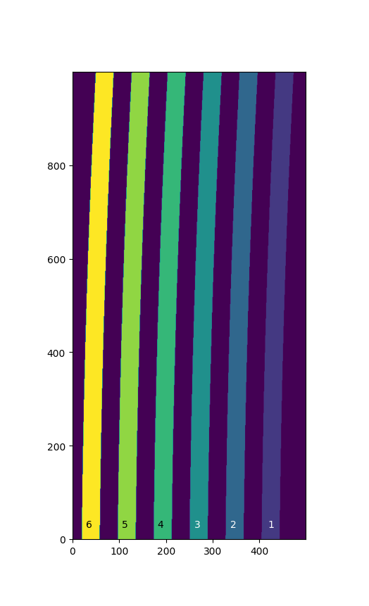

An IFU Example - managing a discontiguous WCS
=============================================

An IFU image represents the projection of several slices on a detector.
Between the slices there are pixels which don't belong to any slice.
In general each slice has a unique WCS transform. 
There are two ways to represent this kind of transforms in GWCS depending on
the way the instrument is calibrated and the available information.

Using a pixel to slice mapping
------------------------------

In this case a pixel map associating each pixel with a slice label (number or string)
is available. The image below represents the projection of the slits of an IFU on a detector
with a size (500, 1000). Slices are labeled from 1 to 6, while label 0 is reserved for pixels
between the slices.

There are several models in GWCS which are useful in creating a WCS.

Given (x, y) pixel indices, `~gwcs.selector.LabelMapperArray` returns labels (int or str)
associated with these indices. `~gwcs.selector.RegionsSelector`
maps labels with transforms. It uses the `~gwcs.selector.LabelMapperArray` to map
these transforms to pixel indices.

A step by step example of constructing the WCS for an IFU with 6 slits follows.

First, import the usual packages.

  >>> import numpy as np
  >>> from astropy.modeling import models
  >>> from astropy import coordinates as coord
  >>> from astropy import units as u
  >>> from gwcs import wcs, selector
  >>> from gwcs import coordinate_frames as cf

The output frame is common for all slits and is a composite frame with two subframes,
`~gwcs.coordinate_frames.CelestialFrame` and `~gwcs.coordinate_frames.SpectralFrame`.

  >>> sky_frame = cf.CelestialFrame(name='icrs', reference_frame=coord.ICRS(), axes_order=(0, 2))
  >>> spec_frame = cf.SpectralFrame(name='wave', unit=(u.micron,), axes_order=(1,), axes_names=('lambda',))
  >>> cframe = cf.CompositeFrame([sky_frame, spec_frame], name='world')
  >>> det = cf.Frame2D(name='detector')

All slices have the same input and output frames, however each slices has a different model transforming
from pixels to world coordinates (RA, lambda, dec). For the sake of brevity this example uses a simple
shift transform for each slice. Detailed examples of how to create more realistic transforms
are available in :ref:`imaging_example`.

  >>> transforms = {}
  >>> for i in range(1, 7):
  ...     transforms[i] = models.Mapping([0, 0, 1]) | models.Shift(i * 0.1) & models.Shift(i * 0.2) & models.Scale(i * 0.1)

One way to initialize `~gwcs.selector.LabelMapperArray` is to pass it the shape of the array and the vertices
of each slit on the detector {label: vertices} see :meth: `~gwcs.selector.LabelMapperArray.from_vertices`.
In this example the mask is an array with the size of the detector where each item in the array
corresponds to a pixel on the detector and its value is the slice number (label) this pixel
belongs to.

Assuming the array is stored in
`ASDF <https://asdf-standard.readthedocs.io/en/latest>`__ format, create the mask:

.. doctest-skip-all

  >>> import asdf
  >>> f = asdf.open('mask.asdf')
  >>> data = f.tree['mask']
  >>> mask = selector.LabelMapperArray(data)

Create the pixel to world transform for the entire IFU:

  >>> regions_transform = selector.RegionsSelector(inputs=['x','y'],
  ...                                              outputs=['ra', 'dec', 'lam'],
  ...                                              selector=transforms,
  ...                                              label_mapper=mask,
  ...                                              undefined_transform_value=np.nan)

The WCS object now can evaluate simultaneously the transforms of all slices.

  >>> wifu = wcs.WCS(forward_transform=regions_transform, output_frame=cframe, input_frame=det)
  >>> y, x = mask.mapper.shape
  >>> y, x = np.mgrid[:y, :x]
  >>> r, d, l = wifu(x, y)

or of single slices.

The :meth:`~gwcs.selector.RegionsSelector.set_input` method returns the forward_transform for
a specific label.

  >>> wifu.forward_transform.set_input(4)(1, 2)
      (1.4, 1.8, 0.8)

Custom model storing transforms in a dictionary
-----------------------------------------------

In case a pixel to slice mapping is not available, one can write a custom mdoel
storing transforms in a dictionary. The model would look like this:

.. code::

    from astropy.modeling.core import Model
    from astropy.modeling.parameters import Parameter

    
    class CustomModel(Model):
    
        inputs = ('label', 'x', 'y')
        outputs = ('xout', 'yout')

        def __init__(self, labels, transforms):
            super().__init__()
	    self.labels = labels
	    self.models = models
	    
	def evaluate(self, label, x, y):
	    index = self.labels.index(label)
            return self.models[index](x, y)
        
