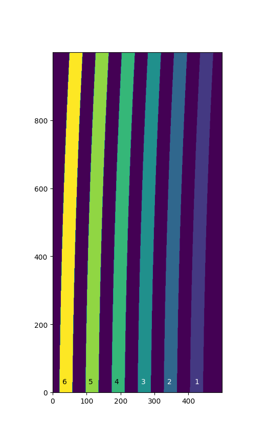

An IFU Example
==============

The `~gwcs.selector.RegionsSelector` class maps transforms to
regions on the detector and provides the means to select a transform for a specific region.
The example below uses this class to describe the WCS of an IFU observation.

For this example we look at an IFU with 6 slits.
In general each slit has a WCS asosciated with it. The output coordinate frame
for each slit is a composite frame with two frames, `~gwcs.coordinate_frames.CelestialFrame`
and `~gwcs.coordinate_frames.SpectralFrame`. For each slit the WCS object transforms pixel
coordinates to world coordinates (RA, DEC, lambda).
For the sake of brevity we assime the transform for each slit has been created.
A detailed example of how to create a transform is in the ref: imaging_example.

In order to use the `~gwcs.selector.SelectorModel` we need a list of labels
and a mask. Labels are integers or strings (less efficient) which map to the location of slits in pixel space. Each label has a transform associated with it. The mask is an array with the size of the detector where each item in the array corresponds to a pixel on the detector and its value is the slice number (label) this pixel belongs to.

The image above shows the projection of the 6 slits on the detector and represents the mask used in the example. Pixels, labeled "0" do not belong to any slit.

Assuming the transforms from pixel to world coordinates for each slit are named "p2w_#", where "#" is the slit label, the pixel to world transform for the entire IFU can be created:

  >>> mapping = {1: p2w_1, 2: p2w_2, 3: p2w_3, 4: p2w_4, 5: p2w_5, 6: p2w_6]
  >>> mask = selector.SelectorMask(masked_array)
  >>> forward = gwcs.RegionsSelector(inputs=['x','y'], outputs=['ra', 'dec', 'lam'], selector=mapping, mask=mask, undefined_transform_value=np.nan)

We have chosen in this example to set the world coordinate value for pixels which do not belong to any slit to NaN but any number is an acceptable value.

Next we need to create the output coordinate system - a `~gwcs.coordinate_frames.CompositeCoordinateFrame` which consistes of two frames: a `~gwcs.coordinate_frames.CelestialFrame` with an `~astropy.coordinates.ICRS` reference frame and  a `~gwcs.coordinate_frames.SpectralFrame` with a `~gwcs.coordinate_frames.spectral_builtin_frames.Wavelength` reference frame.

  >>> celestial = gwcs.CelestialFrame(coord.ICRS())
  >>> spec = gwcs.SpectralFrame(gwcs.spectral_builtin_frames.Wavelength(), unit=[u.micron], axes_names=['lambda'])
  >>> output_system = gwcs.CompositeFrame([celestial, spec])
  >>> print output_system.unit
  [Unit("deg"), Unit("deg"), Unit("micron")]

The WCS for the IFU observation is created by passing the input and output coordinate systems and the transform between them. To transform from pixel to world coordinates we simply call the WCS object. ``x`` and ``y`` below are coordinates in the detector pixel space.

  >>> wifu = gwcs.WCS(input_frame='detector', output_frame=output_system, forward_transform=forward)
  >>> x, y = 1, 2
  >>> result = wifu(x, y)
  >>> print result
  (5.63043056, -72.05454345, 0.00000344)

Because the transform is an instance of `~gwcs.selector.RegionsSelectorModel`, we can
pass a ``region_id`` to the WCS function and perform the transform for a particular slice number.
For example, to transform coordinates in slice 4:

  >>> transform(x, y, 4)
  (5.63024693, -72.05452058, 0.00000344)

Note that ``x``and ``y`` are now pixels in the coordinate system associated with the 4th slice,
not the entire detector.

