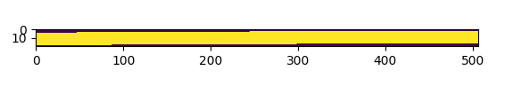
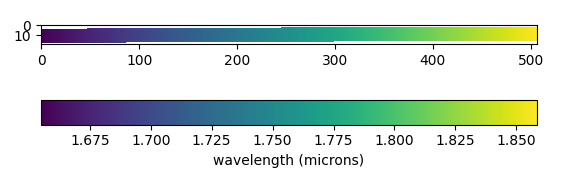

.. _user_intro:

Using Generalized World Coordinate System Models
================================================

Brief Introduction and Outline
------------------------------

`GWCS (Generalized World Coordinate System) <https://github.com/spacetelescope/gwcs>`__ 
package is intended as a generalization of the FITS WCS standards, which basically provides
a transformation from detector array coordinates to sky, spectral, time or any other physical
coordinates, and the converse: from the physical coordinates to the corresponding detector
array coordinates. While simple in principle, it can be a complex subject. The main focus
of this documentation is first the user, who only needs to know how to use GWCS objects,
but doesn't care about the complexities or the internals of how they work, nor the justification
for this new standard. Those interested in those internals or the motiviations for GWCS 
will find this material in later sections.

The documentation is organized into the following sections:

* User Perspective: How to use GWCS models, usually packaged with the data.
* Saving and reading GWCS models.
* Developer Perspective: How to create and modify GWCS models.
* Motivation: Why GWCS was developed and how it is a large improvement over FITS WCS.

User Perspective
----------------

As mentioned, the focus here is on using GWCS models provided by others, most likely, models
that are packaged with the data they apply to.

.. _pixel-conventions-and-definitions:

Terminology and Conventions
...........................

To use WCS models (of any kind, FITS or GWCS) it is important to understand the terminology 
and conventions, particularly with regard to pixel coordinates. For example, are the pixel
coordinates 0 or 1 based? That is, is the first pixel identified as 0 or 1? GWCS assumes 0 
(whereas FITS assumes 1). However, like FITS, integer pixel values 
are presumed to refer to the center of the pixel. So for GWCS, the boundaries of the first 
pixel are at -0.5 and +0.5 for all dimensions.

The greatest source of confusion
will likely be the the presumed order of pixel coordinates. There are two main 
conventions for ordering pixel coordinates. In the context of
2-dimensional imaging data/arrays, one can either think of the pixel coordinates
as traditional Cartesian coordinates (which we call ``x`` and ``y`` here), which
are usually given with the horizontal coordinate (``x``) first, and the vertical
coordinate (``y``) second, meaning that pixel coordinates would be given as
``(x, y)``. Alternatively, one can give the coordinates by first giving the row
in the data, then the column, i.e. ``(row, column)``. While the former is a more
common convention when e.g. plotting (think for example of the Matplotlib
``scatter(x, y)`` method), the latter is the convention used when accessing
values from e.g. Numpy arrays that represent images (``image[row, column]``).

The GWCS object assumes Cartesian order ``(x, y)``, however it should be mentioned
that there is an WCS shared API for both GWCS and FITS WCS that can use
either ordering. The details regarding the shared API will be found later.

.. _installing-gwcs:

Installing GWCS
...............

To install the latest release::

.. code-block:: shell

    pip install gwcs

To install as a conda package from `conda-forge <https://github.com/conda-forge/gwcs-feedstock>`__:

.. code-block:: shell

    conda install -c conda-forge gwcs

To install the latest development version from source (not generally recommended
unless one needs a very new feature or bug fix)::

.. code-block:: shell

     pip install git+https://github.com/spacetelescope/gwcs.git

If the clone has already been done:

     cd gwcs
     pip install .

If you wish to install directly from source with the ability to edit the source code:

.. code-block:: shell

  git clone https://github.com/spacetelescope/gwcs.git
  cd gwcs
  pip install -e gwcs

Simple Image Use
................

This section will illustrate using the GWCS object packaged with the image data
in an ASDF file to perform conversions from pixel coordinates to world coordinates
and visa versa. The following image wcs is intended for use with a 1000 by 1000
pixel image. This is a comparatively simple WCS model for illustration purposes,
that has been constructed to have its reference pixel (500, 500) corresponding 
to ra, dec of (30, 45) in degrees.

.. doctest-skip::

  >>> import asdf
  >>> af = asdf.open('wcs_examples.asdf')
  >>> wcs = af['image_wcs']
  >>> wcs
  <WCS(output_frame=icrs, input_frame=detector, forward_transform=Model: CompoundModel
  Inputs: ('x0', 'x1')
  Outputs: ('alpha_C', 'delta_C')
  Model set size: 1
  Expression: [0] & [1] | [2] & [3] | [4] | [5]
  Components: 
      [0]: <Shift(offset=-500.)>
      [1]: <Shift(offset=-500.)>
      [2]: <Scale(factor=0.00002778)>
      [3]: <Scale(factor=0.00002778)>
      [4]: <Pix2Sky_Gnomonic()>
      [5]: <RotateNative2Celestial(lon=30., lat=45., lon_pole=180.)>
  Parameters:
      offset_0 offset_1        factor_2       ... lat_5 lon_pole_5
      -------- -------- --------------------- ... ----- ----------
        -500.0   -500.0 2.777777777777778e-05 ...  45.0      180.0)>
  >>> wcs.output_frame
  <CelestialFrame(name="icrs", unit=(Unit("deg"), Unit("deg")), axes_names=('lon', 'lat'), axes_order=(0, 1), reference_frame=<ICRS Frame>)>
  >>> wcs(500, 600) # Compute the world coordinates of pixel (500, 500),
  >>>               # which is the reference pixel.
  (29.999999999999993, 45.00000000000001)
  >>> sky = wcs(700, 300) # (x, y) corresponding to python image index [300, 700]
  >>> sky
  (30.00785598022662, 44.99444417517315)
  >>> wcs.invert(*sky) # Check to see if the derived world coordinate maps back to the original input coordinates.
  (700.0000000000517, 299.99999999989694)
  >>> x = range(50) # Compute the world coordinates for a set of input points.
  >>> y = [400] * 50
  >>> wcs(x, y)
  (array([29.9803591 , 29.98039838, 29.98043766, 29.98047694, 29.98051623,
          29.98055551, 29.98059479, 29.98063407, 29.98067335, 29.98071263,
          29.98075192, 29.9807912 , 29.98083048, 29.98086976, 29.98090904,
          29.98094832, 29.98098761, 29.98102689, 29.98106617, 29.98110545,
          29.98114473, 29.98118402, 29.9812233 , 29.98126258, 29.98130186,
          29.98134114, 29.98138042, 29.98141971, 29.98145899, 29.98149827,
          29.98153755, 29.98157683, 29.98161612, 29.9816554 , 29.98169468,
          29.98173396, 29.98177324, 29.98181252, 29.98185181, 29.98189109,
          29.98193037, 29.98196965, 29.98200893, 29.98204822, 29.9820875 ,
          29.98212678, 29.98216606, 29.98220534, 29.98224462, 29.98228391]),
   array([44.99722054, 44.99722055, 44.99722055, 44.99722056, 44.99722057,
          44.99722057, 44.99722058, 44.99722059, 44.99722059, 44.9972206 ,
          44.99722061, 44.99722061, 44.99722062, 44.99722063, 44.99722063,
          44.99722064, 44.99722065, 44.99722065, 44.99722066, 44.99722066,
          44.99722067, 44.99722068, 44.99722068, 44.99722069, 44.9972207 ,
          44.9972207 , 44.99722071, 44.99722072, 44.99722072, 44.99722073,
          44.99722073, 44.99722074, 44.99722075, 44.99722075, 44.99722076,
          44.99722077, 44.99722077, 44.99722078, 44.99722079, 44.99722079,
          44.9972208 , 44.9972208 , 44.99722081, 44.99722082, 44.99722082,
          44.99722083, 44.99722083, 44.99722084, 44.99722085, 44.99722085]))

That is all there is to it. Almost.

Use with Spectra
................

GWCS models in cases of spectral data are generally more involved, partly because
not all pixels in the detector array have a valid mapping to actual world coordinates,
and partly due to the many forms spectral data may take. We will start with the simplest
and then to more complex cases.

Some discussion of typical past approaches to spectral WCS issues is useful. Most 
astronomers may not even associate WCS with spectral data. For 1-d spectra, the most
common approach is to provide an array of wavelengths corresponding to the spectrum.
And this only after the spectrum has been extracted. All the WCS issues are buried in
calibration software that figure out the trace along which to extract the pixels and
the 2-d dispersion function to assign the wavelengths.

With more complex spectral cases, much the same thing happens. All the transformation
information is intricately bound to software to manage the resampling of the data.
This approach has been widely accepted, without much consideration of alternate 
approaches. With GWCS, the transforms are made explicit
and bound with the data. This permits modifications
and tweaks to these models without having to rerun the software to recalibrate the
wavelenths. Towards the end of the User section there will be a fuller description
of the advantages of this approach.

For the following cases examples are provided. The GWCS models for each example 
are contained in a corresponding ASDF file. In general, many of these GWCS models
are simpler than would be found in a real instrument, and are intended to illustrate
the principle being discussed. For the most part, one does not need to look at
the details of the underlying GWCS model. The focus is on how they may be used.

Simple Slit Case
................

Generally speaking, a slit will disperse a very narrow rectangular region of the sky
(perhaps with some distortion) onto a roughly rectanglular region of an imaging 
detector (usually more distorted in its outline). In this simple case it is presumed
that one is interested mapping the pixels within the dispersed region into corresponding
world coordinates. Mapping pixels outside of a dispersed region is nonsensical, of course.

Typically the transform takes 2 input pixel coordinates and produces 3 world coordinates, 
RA, Dec, and wavelength.

This particular example is taken from a real JWST case, but made simpler in that both
the WCS model and corresponding data have been extracted from a much larger and complex
data set and placed into a small ASDF file. In particular, this data is part of a
Multi Object Spectrograph (MOS) mode observation using the NIRSpec instrument. The 
extracted data are extracted from a dataset containing many extracted subimages of
the original exposure, where each subimage is effectively the smallest array that
contains the full spectrum from the corresponding "slitlet" used for that spectrum.
The example ASDF file contains the subarray data and the corresponding GWCS model
cooresponding to that subarray.

Because the spectrum of the slitlet is not perfectly rectangular in the raw data,
the subarray that contains it also contains pixels with no spectrum. Those pixels
will not have a valid WCS transformation; for those pixels, the WCS transformation
will yield NaN values. In fact, one way to determine the pixels that would have 
flux in the spectrum is to perform the transformation on all pixels in the subarray;
those without NaN values comprise the area that the spectrum is dispersed onto.

The data in this example does not have any interesting features. It is provided 
mainly to indicate the boundaries for the spectrum in pixels.

Again, we have to be careful about the order of coordinates. The GWS transformation
expects coordinates in x, y order, opposite of the Python numpy convention for 
pixel coordinates.

.. doctest-skip::

 >>> import asdf
 >>> import numpy as np
 >>> from matplotlib import pyplot as plt
 >>> plt.ion()
 >>> af = asdf.open('wcs_examples.asdf')
 >>> wcs = af['slit_wcs']
 >>> data = af['slit_data']
 >>> data.shape
 (20, 507)
 >>> # print world coordinates of a single pixel corresponding to data[11, 220]
 >>> wcs(220, 11)
 (53.132030598112436, -27.806331124113495, 1.743567271284108)
 >>> # OK, but what do these numbers mean, and what units are the wavelenth in?
 >>> wcs.input_frame
 <Frame2D(name="detector", unit=(Unit("pix"), Unit("pix")), axes_names=('x', 'y'), axes_order=(0, 1))>
 >>> wcs.output_frame
 [<CelestialFrame(name="sky", unit=(Unit("deg"), Unit("deg")), axes_names=('lon', 'lat'), axes_order=(0, 1), reference_frame=<ICRS Frame>)>, <SpectralFrame(name="spectral", unit=(Unit("um"),), axes_names=('wavelength',), axes_order=(2,))>]
 >>> # From this we see that the output spatial coordinates use the ICRS system
 >>> # and that the wavelength is in microns.
 >>> # Now determine the valid region of the data array.
 >>> ysize, xsize = data.shape
 >>> y, x = np.mgrid[:ysize, :xsize]
 >>> ra, dec, lam = wcs(x, y)
 >>> # These coordinate arrays will have numerous NaN values. Make a mask with
 >>> # values of 1 for locations with non-NaN values and 0 for NaN values.
 >>> mask = np.ones(data.shape, dtype=np.uint8)
 >>> mask[np.isnan(ra)] = 0
 >>> plt.imshow(mask)

.. doctest-skip::

 >>> plt.clf(); plt.imshow(lam)
 >>> plt.colorbar(orientation='horizontal', label='wavelength (microns)')

.. doctest-skip::

 >>> # Show that the wcs values round trip
 >>> ra1, dec1, lambda1 = wcs(220, 11)
 >>> wcs.invert(ra1, dec1, lambda1)
 [220.26585870644544, 10.995517342079438]

Well, to within 0.005 pixel in y, and 0.27 pixel in x.

Narrowing General Transforms
............................

In the previous subsection the topic of extra coordinates to handle more general
transform cases was introduced. Taking the MOS case in particular, how do we
simplify the GWCS model for a given open slit without requiring the user to
supply the corresponding i, j location explicitly? There is a tool called 
fix_inputs_xxx that generates a new GWCS model where this method allows specifying
one or more input coordinates to a specific value, essentially removing one or
more coordinates from the transformation. For the MOS case, a specific GWCS can
be provided for each open slit, without copying the complex internals of the
transformation for each specific case. The output file has n open slit GWCS
models saved, but each one is compact, effectively saying use the general
transform, with the slit indices specified to be a given i, j. There is only
one complex transform in the file, and several definitions leveraged off of that
single model that take very little space to define.

This same tool can be used for slitless modes (e.g., specifying 0-order locations
for each identified source), or a specified spectral order.

Modifying Transforms / Using Intermediate Frames
................................................

GWCS models are usually transparent. They consist of a pipeline of transforms
between the starting frame (usually detector coordinates), and the final
frame, sky coordinates or spectral coordinates or a combination. In more complex
there may be intermediate frames (e.g., the slit plane for spectrographs). The
transform for each step in the pipeline is usually comprised of an assembly of
simpler transforms (i.e., Astropy compound models). These may include translations,
scaling, or rotation of coordinates, distortions, and other manipulations of
coordinate values. It is
possible to modify constituent transforms (e.g., change parameters for transforms),
replace transforms. It is also possible to extract a sub pipeline of transforms
if one wants to compute the coordinates of an intermediate frame.

But such uses require understanding how GWCS objects are constructed, and is
not covered in this User section. Please read the developer section to undrestand
the details of how to construct and modify GWCS objects.

A Notes about Performance
.........................

There is a comparatively high overhead to evaluating the GWCS model since it 
is comprised of an expression of all underlying transform models. This overhead
is most noticeable when only computing the transformation for one point. If many
points should be transformed, if at all possible, transform all points in one
call to the GWCS model by passing the points as arrays rather than looping over
individual points. Doing thousands at a time essentially renders the overhead
insignificant. 

Saving and Reading GWCS Objects
...............................

The primary motivation for GWCS is the ability to save and recover GWCS models
from a data file. FITS does not provide the necessary tools to do that in any
standard way. The Advanced Scientific Data Format (ASDF) 
<https://www.asdf-format.org/en/latest/>` __ format was created 
in large part to be able to store
GWCS objects. Support for storing
GWCS objects is intrinsically part of the GWCS package, which registers its
ASDF extension with ASDF when installed. In other words, when GWCS is installed,
ASDF understands how to save and recover GWCS objects. 
The structure of an ASDF file can be considered as a dictionary (technically,
including lists as well) where the "keys" are attributes of the nested dictionaries.
If a value of any of these attributes is an GWCS object, it will be converted
into a form that ASDF knows how to save in the file, and upon reading, the
corresponding information will be turned back into a GWCS object in Python 
(Note that ASDF is language neutral, and implementations in other languages
should be able to construct equivalent objects for GWCS in that languages though
none yet exist).

The following example illustrates how easily this can be done

Continuing with the example of the previous spectrograph GWCS case.

.. doctest-skip::

 >>> af2 = asdf.AsdfFile() # Create a new ASDF object
 >>> af2['wcs'] = wcs # Only saving gwcs object in this example
 >>> af2.write_to('my_spectral_wcs.asdf')
 >>> af3 = asdf.open('my_spectral_wcs.asdf') # read it back into memory
 >>> wcs2 = af3['wcs']
 >>> wcs2 == wcs # Confirm it is the same as the one originally stored.
 True

And that is all there is to it

The only format that GWCS supports at this time is ASDF.

JWST currently embeds GWCS information in FITS files as an ASDF FITS extension.

Motivations for GWCS
--------------------

This section is for those that are interested in why GWCS is necessary, or, 
in other words, what is wrong with the FITS WCS standard?

The mapping from ‘pixel’ coordinates to corresponding ‘real-world’ coordinates
(e.g. celestial coordinates, spectral wavelength) is crucial to relating
astronomical data to the phenomena they describe. Images and other types of
data often come encoded with information that describes this mapping – this is
referred to as the ‘World Coordinate System’ or WCS. The term WCS is often used
to refer specifically to the most widely used 'FITS implementation of WCS', but
here unless specified WCS refers to the broader concept of relating pixel ⟷
world. (See the discussion in `APE14
<https://github.com/astropy/astropy-APEs/blob/master/APE14.rst#backgroundterminology>`__
for more on this topic).

The FITS WCS standard, currently the most widely used method of encoding WCS in
data, describes a set of required FITS header keywords and allowed values that
describe how pixel ⟷ world transformations should be done. This current
paradigm of encoding data with only instructions on how to relate pixel to
world, separate from the transformation machinery itself, has several
limitations:

* Limited flexibility. WCS keywords and their values are rigidly defined so that
  the instructions are unambiguous. This places limitations on, for example,
  describing geometric distortion in images since only a handful of distortion
  models are defined in the FITS standard (and therefore can be encoded in FITS
  headers as WCS information).
* Separation of data from transformation pipelines. The machinery that
  transforms pixel ⟷ world does not exist along side the data – there is merely
  a roadmap for how one *would* do the transformation. External packages and
  libraries (e.g wcslib, or its Python interface astropy.wcs) must be written
  to interpret the instructions and execute the transformation. These libraries
  don’t allow easy access to coordinate frames along the course of the full
  pixel to world transformation pipeline. Additionally, since these libraries
  can only interpret FITS WCS information, any custom ‘WCS’ definitions outside
  of FITS require the user to write their own transformation pipelines.
  Furthermore, any custom 'WCS' definitions will not be handled by any WCS
  library that only supports the FITS WCS standard, thus requiring anyone
  that wishes to use it to obtain a custom library.
* Incompatibility with varying file formats. New file formats that are becoming
  more widely used in place of FITS to store astronomical data, like the ASDF
  format, also require a method of encoding WCS information. FITS WCS and the
  accompanying libraries are adapted for FITS only. A more flexible interface
  would be agnostic to file type, as long as the necessary information is
  present.
* Even handling custom WCS elements within the FITS format is made awkward 
  by FITS limitations in keyword, values and general file organization. All
  these factors caused considerable complications for HST data. A concrete
  example will be detailed below.

HST WCS Headaches
.................

Some HST data have the ability to measure positions very accurately. For example
ACS imaging data reveals that it can detect systematic position errors down to 
the 0.003 pixel level. Distortion models for ACS were able obtain 0.01 pixel
accuracy, but this could not be achieved with standard FITS WCS models. This
was partly because the distortion model consisted of 3 different distortion
elements: a 2-d polynomial distortion model; a residual grid-based distortion
correction; and a discontinuous distortion offset due to chip region slight
misalignments. The polynomial model could be handled by a widely accepted
SIP distortion model, but since the FITS WCS model has no provision for 
combining multiple distortion elements, STScI had to construct a model not
consistent with the FITS WCS standard, and not supported by any other library.

But it was worse than that. Two of these distortions required data be stored
in two extensions. And then we were asked to make multiple versions of the
WCS models available within the same file. The multiple versions of keywords,
and extensions became a bookkeeping nightmare. The solution was yet another
variance from the FITS standard, which was to place each WCS model as a
FITS file stored within a FITS extension. We had wandered well down the
road of FITS contortions. The limitations on FITS header keyword lengths
also limits the degree of polynomials that can be employed. 

It should be noted that there have been attempts to try to generalize the
available distortion solutions, most notably FITS WCS paper IV (since
superceeded by a different paper IV!), which has languished for decades
with no hope of acceptance.

To summarize, the FITS WCS standard is general enough to handle most
resampled imaging data, which only needs standard coordinate manipulations
and projections. For unresampled data, it is often not usable. Also, for
spectral data, it is woefully incapable of dealing with the many forms
that raw spectral data take.

Some astronomers may say that they only deal with resampled data and do not
care about the intracacies of distortions or dispersion relations for raw
data. That may be, but more and more often, modern fitting techniques prefer
to use the unresampled data (e.g., Bayesian techniques). And this is where
the FITS WCS standard often is completely inadequate.

Advantages of GWCS
..................

The `GWCS <https://github.com/spacetelescope/gwcs>`__ package and GWCS object is
a generalized WCS implementation that mitigates these limitations. The
capabilities that GWCS provides are:

* Arbitrary construction of transformations from simpler transformations. 
  In other words, one may combine transformations arithmetically, or feed
  the output of a transformation into another. A rich library of
  transformations, including all FITS supported projections, is provided.
* The ability to define intermediate frames of reference, and make those
  accessible. For example, slit plane coordinates.
* Associating frames of reference with standard coordinate systems, such
  as those provided by Astropy.
* Serializing all that information to the data file. A library that supports
  this serialization can compute the coordinate transformations based 
  soley on the file contents.
* Mechanisms for extending the transformations are provided, as well as 
  the ability to provide extensions for serializing such new transformations.
  Such extensions allow an instrument or telescope to produce data that
  uses their extension, where the serialization extension can be incorporated
  into ASDF without requiring a standards update (something that is currently
  quite painful to do in FITS).
* Use of Astropy frames of reference allow for further transforms to other
  standard reference frames using the mechanisms that Astropy provides.
* The transforms support the use of coordinate units based on the Astropy
  unit framework, allowing easy conversion of world coordinates,
  particularly for spectral and time coordinates.
